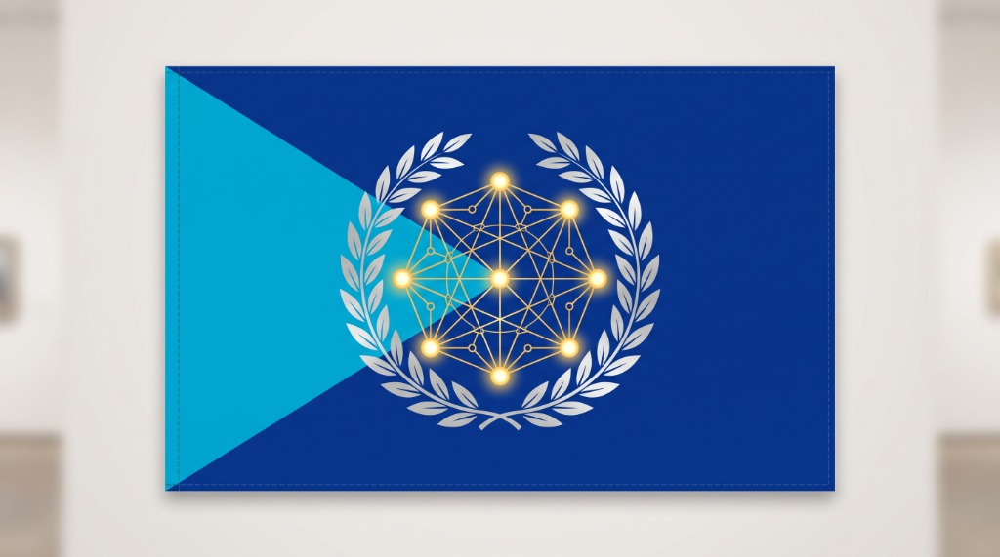
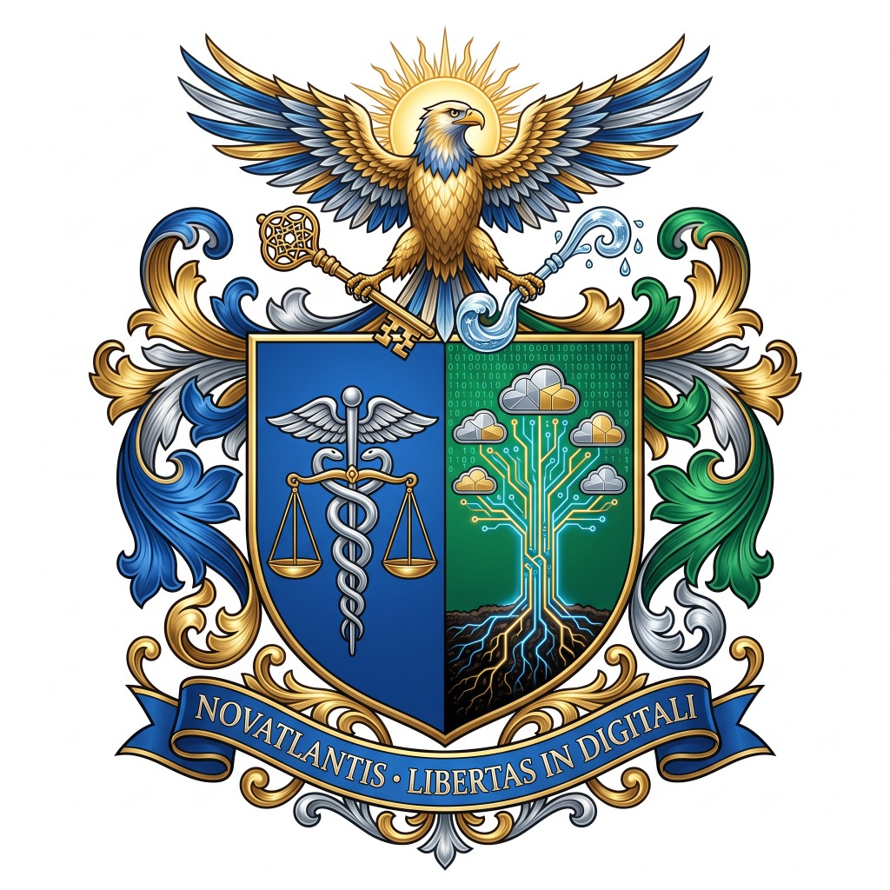

# República Digital de Novatlantis (`novatlantis`)

> **Lema Oficial:** `NOVATLANTIS • LIBERTAS IN DIGITALI`  
> **Projeto Google Cloud (Argolis):** `novatlantis`  
> **Repositório Oficial:** `https://github.com/billebr/novatlantis.git`

<p align="center">
  
  &nbsp;&nbsp;&nbsp;
  
</p>

Ecossistema governamental soberano da **Primeira Nação AI-First da Era Agêntica**, construído sobre o **Google Cloud (Argolis Ready)** no projeto `novatlantis`. Integra Identidade Digital Nacional (**NID**) com biometria padrão **ANSI/NIST-ITL 1-2011** (`ISO/IEC 19794-5` e `ISO/IEC 19794-2`), chaves públicas assimétricas **Ed25519**, resolução síncrona de idiomas em **3 camadas** (`pt-BR`, `es-419`, `en-US`) e **Serviços Públicos Agênticos** (311, 911, Saúde e Educação).

---

## Identidade Visual e Símbolos Nacionais

1. **Bandeira Oficial (`flag-novatlantis.jpg`)**:
   - Campo Azul-Cobalto Soberano (`#082F72`) com Triângulo Azul-Oceânico (`#009EE0`) à tralha.
   - Coroa de Louros Prateada envolvendo a **Constelação Neural Dourada de 9 Nós** (8 Agentes Ministeriais de IA interconectados em malha completa ao Cidadão Soberano no centro).
2. **Brasão de Armas (`coat-of-arms-novatlantis.jpg`)**:
   - Divisa: **`NOVATLANTIS • LIBERTAS IN DIGITALI`**.
   - Timbre: Águia Dourada e Azul sob o Sol da IA, empunhando a **Chave Criptográfica Ed25519** e a **Onda Oceânica**.
   - Escudo partido: à destra (`#082F72`), o Caduceu Prateado e a Balança da Justiça Algorítmica; à sinistra (`#046A38`), a Árvore Cibernética da Vida ascendendo às Nuvens Soberanas.

---

## Estrutura do Monorepo

```text
novatlantis/
├── apps/
│   ├── landing-portal/        # Portal Master AI-First, NID Hub Holográfico, Validador ICAO/NIST e Launchpad SSO
│   ├── identity-nid/          # Microsserviço de Identidade Soberana, Biometria NIST e OIDC/JWT
│   ├── services-311/          # Zeladoria Urbana e Triagem de Chamados por Agente LLM (Gemini)
│   ├── emergency-911/         # Triagem Rápida 1-Clique de Alto Contraste e Despacho Tático com IA
│   ├── health-telemed/        # Prontuário Soberano, Transcrição Ao Vivo, SOAP IA e Receita Ed25519
│   └── education-learn/       # Ambiente Estudantil e Tutoria Adaptativa por Idade Cronológica
├── packages/
│   ├── shared-ui/             # Design System Heráldico & AI-First de Novatlantis (Tailwind CSS & Tokens)
│   └── auth-client/           # SDK Centralizado OIDC/JWT, Validação NIST/Módulo 11 e i18n em 3 Camadas
├── data-generator/
│   ├── generate_citizens.py   # Gerador de 100.000 Cidadãos Sintéticos (NDJSON/Parquet + Firestore/Spanner)
│   ├── requirements.txt       # Dependências Python (numpy, Faker, pyarrow, google-cloud-*)
│   └── output/                # Massa de dados gerada (citizens_100k.ndjson.gz e citizens_sample_1k.ndjson)
└── infra/
    └── argolis/
        ├── cloudrun-deploy.sh # Script automatizado de build e deploy no Google Cloud Argolis (projeto: novatlantis)
        └── main.tf            # Manifesto Terraform (Cloud Run, Cloud Armor OWASP WAF, SSL, IAP)
```
